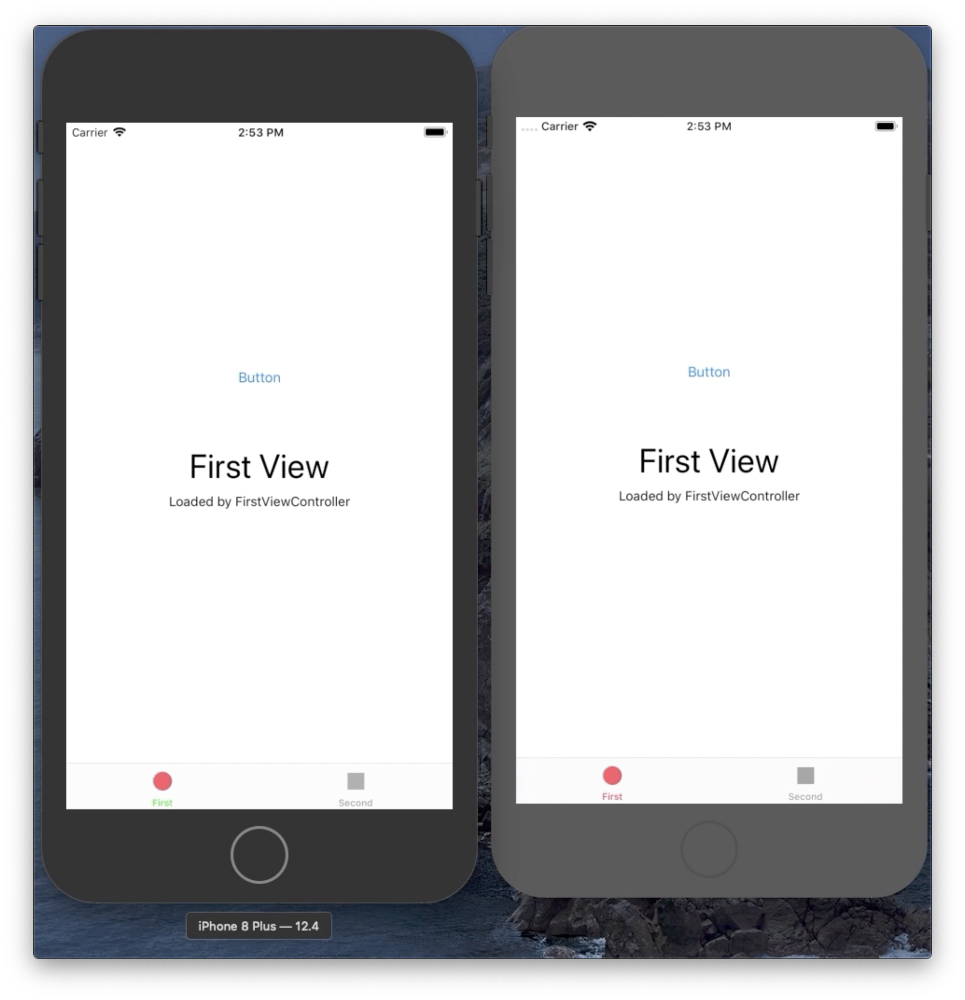

# TabBarLabelBug
Demonstration of UIKit bug introduced in iOS 13

Steps to reproduce:

1) Run associated code in an iOS 13 simulator
2) Notice that tabBar imageTint is red and label text is green for the selected tab
3) Click the button to open an AVPlayerViewController window
4) Close the AVPlayerViewController window
5) Switch tabs and notice that the label color is now set to red

Do the above steps in an iOS 12 simulator to verify this bug is new to iOS 13.

Video:

